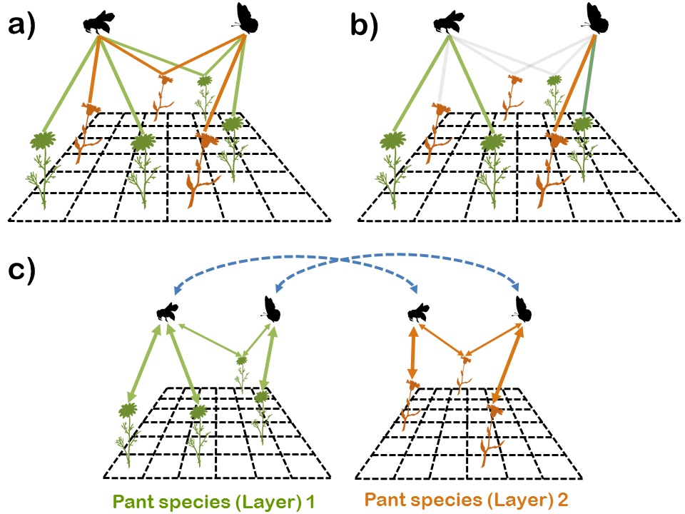

# Multi-motif analysis
Analysis of the effect of several macro-, meso- and micro-structural descriptors of Caracoles' individual-based plant-pollinator multilayer networks (2020) on the fitness of their focal plant individuals. We downscaled the analysis of interactions based on motifs to the level of conspecific and heterospecific plant individuals.


# Calculating the total amount of homospecific and heterospecific triplets per week and pollinator: An example.

Given a network, we can decompose it into smaller subgraphs, called motifs. Here we estimated the amount of undirected triplets that were present in our visitation networks, that is, the pattern of connections of undirected path graphs with length 2 (see panels a and b in the figure above). In addition, we restricted our analysis to triplets with two plant individuals. 

One novel aspect of our work consisted in downscaling the analysis of interactions based on motifs to the level of conspecific and heterospecific plant individuals. Here we introduced a new triplet classification according to the plant species involved. If both focal plants belong to the same species, the triplet was referred to as homospecific motif (see the bee's motif that is highlighted in panel b); otherwise, the motif was classified as heterospecific (see the butterfly's motif that is highlighted in panel b).

To incorporate species’ phenological overlap in our motif analysis, we calculated both types of triplets from the bipartite networks that arose weekly (see panel a for an example of such networks). Thus, heterospecific triplets only appear when different coflowering species that shared pollinators are present in a given week. Here, we show how to estimate total amount of homo- and of heterospecific triplets per week and floral visitor for a given plant.

To run the this example I will use the functions in `R_Scripts/functions.R` and the data in `Example/example.csv`. The metadata in `Example/example.csv` can be described as follows:
* Plot: network/site/year ID.
* Subplot: plant individual ID.
* Plant: plant species ID.
* ID: visitor species ID.
* Visits: number of visits recorded between the plant individual and the visitor species.
* Week: number of the week.

In the figure below we show the information in `Example/example.csv`.

```
# load libraries
library(tidyverse)
library(bipartite)
library(matlib)
library(igraph)

source("R_Scripts/functions.R")

# Loadind example dataset

example_data <- read_csv("Example/example.csv")

aggregate_total <- NULL # tibble that will contain the output

for (week_i in unique(example_data$Week)){

  # Extract data of week_i

  example_week_i <- example_data %>% filter(Week==week_i)
 
  # Aggregate visits by week 
 
  example_week_i <- example_week_i %>% group_by(Plot,Subplot,Plant,ID) %>%
    count(wt=Visits) %>% rename(Visits_tot = n)
  
  example_week_i$Subplot_Plant_Label <- paste(example_week_i$Subplot,example_week_i$Plant,sep = " ")
  
  aggregate_week_i <- example_week_i %>% ungroup() %>% 
    select(Plot,ID,Subplot_Plant_Label,Visits_tot)
    
  # Extract homospecific- and heterospecific triplets
  
  aggregate_week_i <- homo_hete_motifs(aggregate_week_i)
  aggregate_week_i <- aggregate_week_i %>% mutate(Week=week_i)
  
  # Update the output variable
  aggregate_total <-  bind_rows(aggregate_total, aggregate_week_i) 
  
}

aggregate_total %>% separate(Subplot_Plant_Label,c("Subplot","Plant"), " ")

# A tibble: 6 x 8
   Plot ID        Subplot Plant      Visits_tot homo_motif hete_motif  Week
  <dbl> <chr>     <chr>   <chr>           <dbl>      <int>      <int> <dbl>
1     1 Poll_Sp_1 Ind_1   Plant_Sp_A          4          1          0     7
2     1 Poll_Sp_2 Ind_1   Plant_Sp_B          1          0          0     7
3     1 Poll_Sp_1 Ind_2   Plant_Sp_A          1          1          0     7
4     1 Poll_Sp_2 Ind_1   Plant_Sp_B          1          0          1     8
5     1 Poll_Sp_1 Ind_2   Plant_Sp_A          1          0          0     8
6     1 Poll_Sp_2 Ind_2   Plant_Sp_A          1          0          1     8
```

Session info
```
sessionInfo()
R version 3.6.3 (2020-02-29)
Platform: x86_64-w64-mingw32/x64 (64-bit)
Running under: Windows 8.1 x64 (build 9600)

Matrix products: default

locale:
[1] LC_COLLATE=Spanish_Ecuador.1252  LC_CTYPE=Spanish_Ecuador.1252   
[3] LC_MONETARY=Spanish_Ecuador.1252 LC_NUMERIC=C                    
[5] LC_TIME=Spanish_Ecuador.1252    

attached base packages:
[1] stats     graphics  grDevices utils     datasets  methods   base     

other attached packages:
 [1] igraph_1.2.5         matlib_0.9.2         bipartite_2.14       sna_2.5             
 [5] network_1.16.0       statnet.common_4.3.0 vegan_2.5-6          lattice_0.20-38     
 [9] permute_0.9-5        forcats_0.4.0        stringr_1.4.0        dplyr_1.0.2         
[13] purrr_0.3.3          readr_1.3.1          tidyr_1.0.2          tibble_3.0.3        
[17] ggplot2_3.3.2        tidyverse_1.3.0 
```
